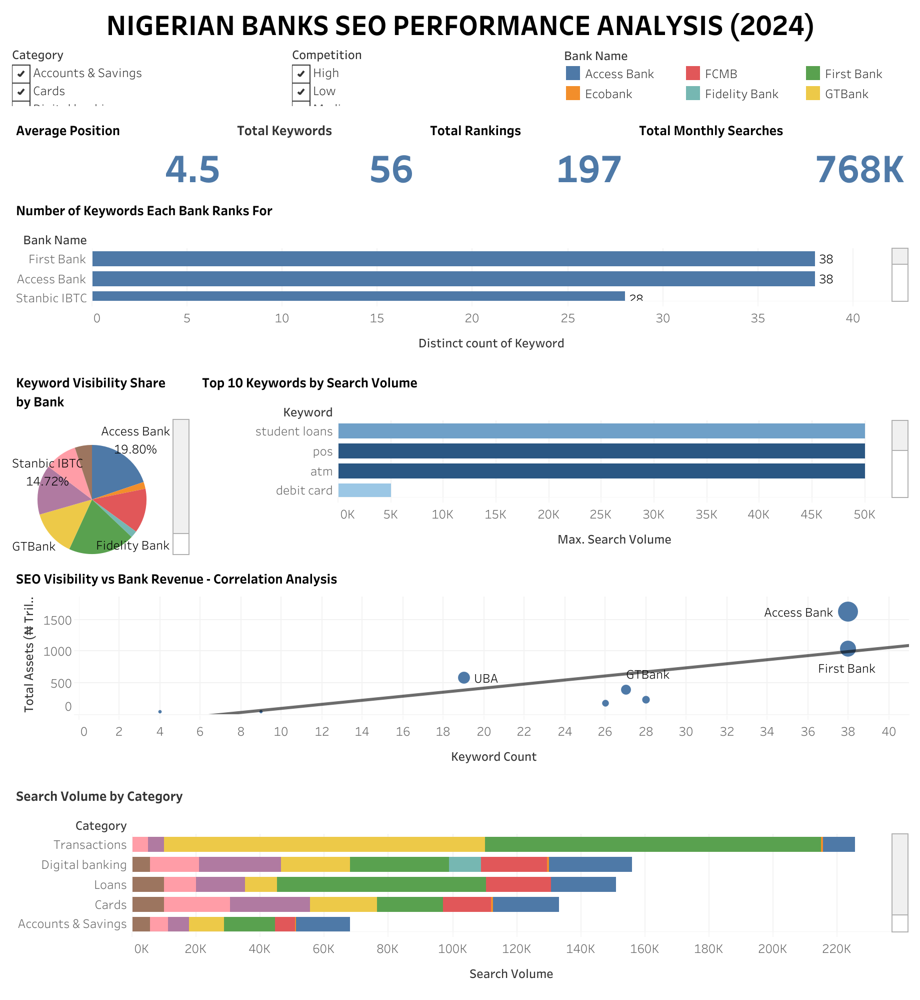

# Nigerian Banks SEO Performance Analysis (2024)

## 📌 Overview
This project analyzes the SEO performance of the top 10 Nigerian banks by evaluating their visibility across high-value consumer banking keywords.

The goal is to uncover:
- Which banks dominate search rankings
- Untapped keyword opportunities
- The relationship between financial strength and digital visibility

---

## 🎯 Objectives
- Analyze organic search visibility across Nigerian banks
- Identify high-volume, low-competition keywords
- Evaluate SEO performance by category
- Provide strategic recommendations for digital growth

---

## 🛠️ Tools Used
- Google Keyword Planner (Keyword research)
- Google Sheets (Data cleaning & structuring)
- Tableau Public (Data visualisation)

---

## 📂 Dataset
The dataset includes:
- 58 high-intent banking keywords
- Monthly search volumes
- Competition levels
- Bank ranking positions (SERP analysis)
- Bank financial data (assets)

---

## 📊 Dashboard Preview

🔗 **Live Dashboard:**  
https://public.tableau.com/app/profile/iyanujesu.obakoya/viz/SEOPERFORMANCEANALYSISOFTOP10NIGERIANBANKS2024/Dashboard1

---

## 📈 Key Insights
- 80% of keywords have low competition → huge SEO opportunity
- Digital banking keywords have the highest search demand
- Weak correlation between bank size and SEO performance
- Some Tier 1 banks underperform significantly in search visibility

---

## 💡 Recommendations
- Invest in SEO content for low-competition keywords
- Prioritise digital banking search terms
- Improve technical SEO (site speed, mobile optimisation)
- Leverage content marketing for financial education

---

## 📄 Full Report
See detailed analysis here:  
📎 

---

## 👤 Author
**Iyanujesu Obakoya (IJ)**  
Data Scientist  

---

## 🌍 Project Impact
This project highlights how data-driven SEO strategies can help financial institutions improve digital visibility, customer acquisition, and competitive positioning in Nigeria's evolving banking landscape.
